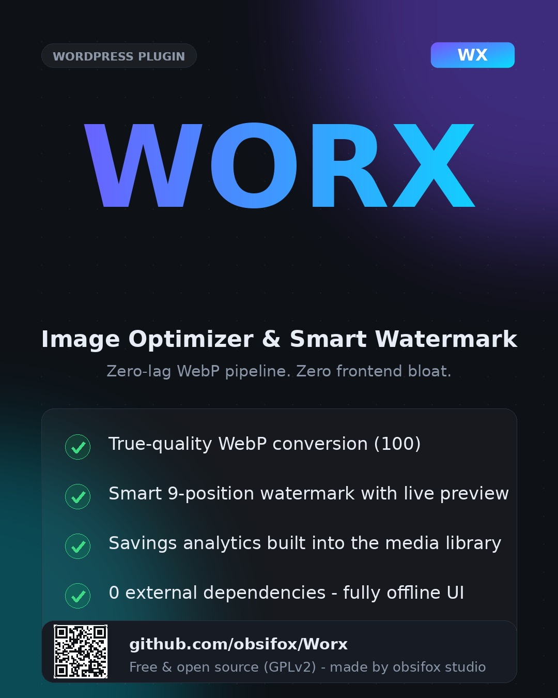

# Worx Image Optimizer & Smart Watermark

> Ultra-fast image pipeline for WordPress. True-quality WebP conversion, smart resizing, real-time 9-position watermarking and a modern media hub. **Zero frontend bloat. Zero external dependencies.**

Built by **obsifox studio**.



## Features

- **Automatic WebP conversion** at quality 100 (true lossless on servers with Imagick; maximum quality on GD).
- **Smart resizing** - uploads wider than your maximum width are downscaled before encoding.
- **Real-time watermark** with a 9-anchor position matrix, adjustable opacity and a swappable logo (built-in neon WX logo or any image from your media library).
- **Setup wizard** with a live watermark preview - every slider and anchor responds instantly, with zero server round-trips (pure Vanilla JS).
- **Modern media hub** - a Worx column in the Media Library showing savings %, WebP and watermark status, one-click **Reprocess** per image, and a library-wide stats strip.
- **Savings analytics** - original vs. optimized size and percentage stored per attachment.
- **i18n ready** - the code base is 100% English (GNU gettext, text domain `worx`); a complete **Persian (fa-IR)** translation is bundled and RTL layouts are included.

## Performance guarantees

| Area | Approach |
| :--- | :--- |
| Frontend | **Absolute zero footprint** - nothing is enqueued for site visitors |
| Icons | Inline SVG (Google Material path data, inlined) - no icon fonts, no CDN requests |
| Wizard preview | Vanilla JS with direct DOM manipulation - 0 ms perceived lag |
| Database | Single settings row (`worx_settings`) + one postmeta record per image (`_worx_metadata`) |

## Requirements

- WordPress **5.8+**
- PHP **7.2+** with **GD** (WebP support) or **Imagick**
- When neither extension is available the plugin degrades gracefully: uploads pass through untouched (Fallback Engine).

## Installation

1. Upload `worx-image-optimizer.zip` via **Plugins > Add New > Upload Plugin**, or clone this repository into `wp-content/plugins/`.
2. Activate the plugin - you are redirected straight to the setup wizard (**Media > Worx**).
3. Pick your watermark anchor, opacity and engine options, then save.
4. Every new JPG/PNG upload is converted, watermarked and optimized automatically.
5. Re-process older images from the Media Library with the **Reprocess** action.

## Safety model

- **MIME sniffing:** real file bytes are verified with `finfo` before any processing - a fake `.jpg` is never touched.
- **Nonces + RBAC:** the wizard save uses `check_admin_referer('worx_wizard_action', 'worx_nonce')` + `manage_options`; AJAX reprocess requires `upload_files` + nonce.
- **Atomic file swap:** WebP output is encoded to a temporary slot and moved into place only after a successful encode.
- **Fallback Engine:** if any step fails, the original file stays intact and the upload proceeds unchanged.
- **Full uninstall:** deleting the plugin removes settings, pending queues and all `_worx_metadata` records.

## Internationalization

The plugin ships in English. Persian (fa-IR) is fully translated and bundled in `/languages` (`worx-fa_IR.po` / `.mo`); RTL styles apply automatically on fa-IR sites. To add a language, translate `languages/worx.pot` and drop the compiled `.mo` in place.

## Architecture

```
worx-image-optimizer/
├── worx.php                          Bootstrap + activation hooks
├── uninstall.php                     Full data cleanup
├── includes/
│   ├── class-worx-core.php           Lifecycle, single-row settings, wizard redirect
│   ├── class-worx-optimizer.php      Pipeline: sniff -> resize -> watermark -> WebP -> meta
│   ├── class-worx-watermark.php      9-anchor math + alpha compositing (GD/Imagick)
│   ├── class-worx-wizard.php         Setup wizard render + save handler
│   ├── class-worx-media-hub.php      Media column, AJAX reprocess, stats strip
│   └── class-worx-i18n.php           gettext loader
├── assets/
│   ├── css/  wizard.css, media-hub.css   (isolated scopes, .rtl rules)
│   ├── js/   wizard.js, media-hub.js     (Vanilla JS, admin screens only)
│   ├── icons/svg-icons.php              (inline Material SVGs + WX logo)
│   └── img/  wx-watermark.png, demo-product.jpg
└── languages/  worx.pot, worx-fa_IR.po, worx-fa_IR.mo
```

Upload pipeline:

```
[User upload: JPG/PNG]
        |
[wp_handle_upload filter]
        |
[Real-byte MIME validation]
        |
[1. Resize to max_width (if needed)]
[2. Watermark at the 9-anchor position]
[3. WebP encode (Imagick lossless @100 / GD max quality)]
[4. Atomic file swap + optional original removal]
[5. Store size analytics in _worx_metadata]
        |
[WebP attachment in the media library]
```

## License

GPL-2.0-or-later. Google Material icon path data used under Apache-2.0 (inlined, credits preserved in `assets/icons/svg-icons.php`).
