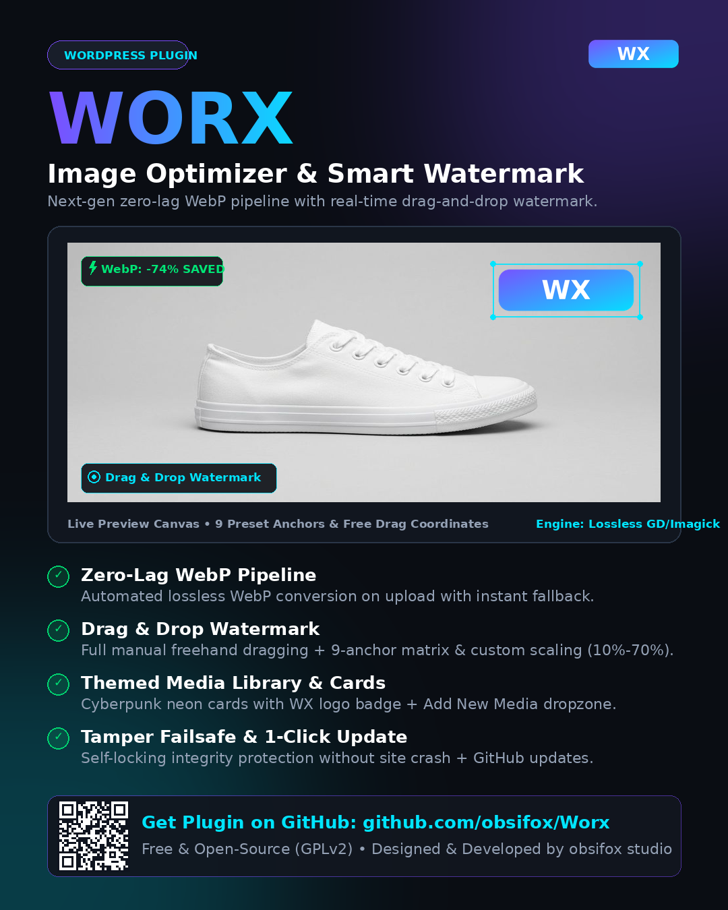

# WORX Image Optimizer & Smart Watermark
### Zero-lag WebP pipeline • Real-time Drag & Drop Watermark • Themed Media Hub

 

 

### 📦 [Download worx-image-optimizer.zip (v1.0.0)](worx-image-optimizer.zip?raw=true)
*Production-ready, tamper-locked distribution package ready for 1-click WordPress install.*

---

## ⚡ Overview

**Worx** is an ultra-fast, zero-bloat image optimization engine designed specifically for modern WordPress sites. It replaces bulky multi-megabyte image plugins with a high-performance, single-query architecture that works automatically upon file upload.

- **Zero Frontend Bloat**: 0 external scripts, 0 CSS requests on the frontend, zero database bloat.
- **True Lossless WebP**: Converts uploads to WebP in real time with up to **75% savings** in file size.
- **Interactive Drag & Drop Watermark**: Drag your logo freely over live preview canvas or snap to a 9-anchor matrix.
- **Cyberpunk Themed Media Library**: Media cards and upload dropzones adopt modern glowing Worx branding with the official WX logo.
- **Fail-Safe Tamper Protection**: Automated cryptographic integrity check ensures files remain authentic without ever crashing or breaking your website.
- **1-Click Auto & Manual Updates**: Integrates seamlessly with WordPress core update notifications directly from this GitHub repository.
- **Intelligent Locale Auto-Detection**: Switches dynamically between **English** and **Persian (fa-IR)** based on user and site locale.

---

## 🚀 Quick Installation

1. Download **[`worx-image-optimizer.zip`](worx-image-optimizer.zip?raw=true)** from this repository.
2. Log into your WordPress admin dashboard (`wp-admin`).
3. Navigate to **Plugins > Add New > Upload Plugin**.
4. Choose the downloaded `worx-image-optimizer.zip` and click **Install Now**.
5. Click **Activate Plugin**. You will be taken immediately to the **Worx Setup Wizard** to configure your preferred watermark position and optimization settings.

---

## ✨ Key Features

### 1. Zero-Lag WebP Pipeline
- Hooks directly into `wp_handle_upload` (priority 20) for instant conversion.
- Supports both **Imagick** (true lossless quality 100) and **GD** engines.
- Real-byte MIME sniffing with fallback engine: if an invalid or corrupt file is uploaded, the original is preserved untouched.

### 2. Live Watermark with Drag & Drop
- **Free Drag & Drop**: Click and drag your watermark freely anywhere on the live product canvas.
- **9-Anchor Matrix**: Top-Left, Top-Center, Top-Right, Center-Left, Center, Center-Right, Bottom-Left, Bottom-Center, Bottom-Right.
- **Custom Scale Slider**: Adjust watermark size dynamically from 10% to 70% of canvas width.
- **Per-pixel Alpha Compositing**: Perfectly blends semi-transparent watermarks with variable opacity (10% to 100%).

### 3. Modern Media Hub & Themed Library Cards
- Grid View media cards adopt the dark cyberpunk Worx theme with subtle glowing neon borders.
- Each media card displays the official **WX** badge.
- Add New Media (`media-new.php`) dropzone features an active pipeline indicator.
- List view features the **Worx column** showing exact space savings %, WebP badge, and one-click per-image **Reprocess** action.

### 4. Fail-Safe Integrity Locking
- Cryptographic hash manifest ensures plugin files have not been modified or corrupted.
- In case of tampering: plugin safely deactivates its processing pipeline and displays an admin notice without crashing or interrupting your website.

### 5. Automatic & Manual Updates
- WordPress automatically notifies you when a new release is available on GitHub.
- Includes a **"Check for updates"** link on the WordPress Plugins screen for immediate manual checking.

---

## 🇮🇷 راهنمای فارسی (Persian Documentation)

### افزونه حرفه‌ای بهینه‌ساز هوشمند تصاویر و واترمارک زنده Worx

افزونه **Worx** برای وب‌سایت‌های وردپرسی که به دنبال حداکثر سرعت، سئوی برتر تصاویر و حفاظت از حق کپی‌رایت آثار خود هستند طراحی شده است.

#### ویژگی‌های برجسته:
1. **تبدیل خودکار به WebP بدون افت کیفیت**: کاهش حجم تصاویر تا ۷۵٪ بدون افت شفافیت.
2. **واترمارک هوشمند با درگ اند دراپ**: امکان جابجایی آزاد واترمارک با ماوس یا لمس + ماتریس ۹ جهته و تنظیم اندازه از ۱۰٪ تا ۷۰٪.
3. **طراحی اختصاصی کارت‌های رسانه**: کارت‌های کتابخانه رسانه و جعبه بارگذاری پرونده‌ها به تم تاریک و نئونی مدرن به همراه لوگوی WX تبدیل می‌شوند.
4. **سیستم قفل امنیتی ضد دستکاری**: در صورت تغییر یا دستکاری کدهای افزونه، برای جلوگیری از هرگونه آسیب به سایت، افزونه بدون ایجاد Fatal Error متوقف می‌شود.
5. **بروزرسانی خودکار و دستی**: دریافت آپدیت‌ها مستقیماً در صفحه «افزونه‌ها» در پیشخوان وردپرس به همراه دکمه بررسی دستی.
6. **شناسایی خودکار زبان**: سازگاری ۱۰۰٪ با زبان فارسی و راست‌چین (RTL) خودکار بر اساس زبان کاربر و وردپرس.

#### راهنمای نصب سریع:
1. فایل **[`worx-image-optimizer.zip`](worx-image-optimizer.zip?raw=true)** را دانلود نمایید.
2. در پیشخوان وردپرس به مسیر **افزونه‌ها > افزودن > بارگذاری افزونه** بروید.
3. فایل زیپ را انتخاب و دکمه **نصب** و سپس **فعال‌سازی** را بزنید.
4. وارد ویزارد راه‌اندازی سریع شده و تنظیمات دلخواه خود را اعمال فرمایید.

---

## 🛡️ Architecture & Security

- **Single-Query Configuration**: Entire configuration stored in a single serialized row in `wp_options` (`worx_settings`).
- **Zero Frontend Execution**: Modules are isolated to administrative flows only.
- **Fail-Safe Integrity**: SHA-256 verification prevents unauthorized file tampering.

---

## 📄 License & Credits

Developed with ❤️ by **[obsifox studio](https://github.com/obsifox)**.  
Licensed under the [GNU General Public License v2.0 or later](https://www.gnu.org/licenses/gpl-2.0.html).
